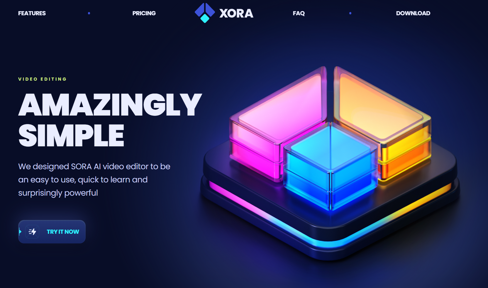

# 
# Coding Along with Adrian (JavaScript Mastery)

Welcome to my coding journey! In this repository, I am following along with Adrian from [JavaScript Mastery](https://www.youtube.com/watch?v=ukiGFmZ32YA&t=336s&ab_channel=JavaScriptMastery). As an aspiring software developer, I'm using this project to learn best practices and improve my skills.

## 📚 Project Overview

This project is based on a tutorial where Adrian guides viewers through the development of a modern SaaS app landing page using React.js, Tailwind CSS, and Vite. While I am not the original developer of this application, I am documenting my progress and any challenges I face while coding along with him.

## 🎥 Video Reference

You can watch the tutorial here: [JavaScript Mastery Tutorial](https://www.youtube.com/watch?v=ukiGFmZ32YA&t=3s&ab_channel=JavaScriptMastery).

🛠️ **Technologies Used**

Vite: A build tool that provides a faster and leaner development experience for modern web projects.

React.js: A JavaScript library for building user interfaces.

Tailwind CSS: A utility-first CSS framework for rapidly building modern websites and applications.

# 🚀 Features

👉 **Stunning Sections**: Includes hero, features, pricing (monthly/yearly), FAQ, testimonials, and download software
sections.

👉 **Smooth Animations**: Complex CSS for fluid animations and eye-catching effects.

👉 **Cool CSS Gradients**: Beautiful gradient effects using CSS `before` and `after` pseudo-elements.

👉 **Seamless Navigation**: Offers a smooth user experience with intuitive navigation and scrolling.

👉 **Optimized Performance**: Built for fast loading and an optimized experience.

👉 **Pixel Perfect Design**: Ensures flawless responsiveness across all devices and screen sizes.

## 💡 What I Learned

As this is my second major project, I gained valuable experience in:

##### **React Development**

- Component-Based Architecture
- State Management
- Props and Component Communication
- React Hooks
- Lifecycle Methods
- Conditional Rendering

##### **Tailwind CSS**

- Utility-First CSS Approach
- Responsive Design
- Customization and Theming
- Advanced Layout Techniques
- Pseudo-Classes and States

##### **Vite**

- Modern Development Workflow
- ES Modules and Modern JavaScript
- Configuring Build Process: Gained
- Optimizing for Production

##### **Version Control with Git**

- Committing changes and managing branches.
- Collaborating and tracking progress over time.
- Maintained clear documentation and code comments.

## 🤝 Acknowledgments

Adrian Hajdin: For the comprehensive tutorial and
guidance. [JavaScript Mastery](https://www.youtube.com/watch?v=kt0FrkQgw8w&t=3910s&ab_channel=JavaScriptMastery).

## 📄 License

This project is licensed under the MIT License.

Note: This project is for educational purposes and is free to use under the terms of the MIT License.